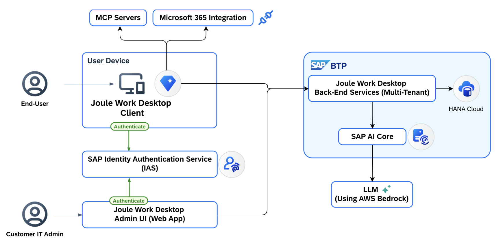

# Solution Overview - Joule Work Desktop

## Introduction

**Joule Work Desktop (JWD)** is an AI-powered desktop application that helps business users complete everyday work more efficiently by bringing research, analysis, summarization, drafting, and contextual assistance into one secure workspace.

JWD works across:
- Local files
- Business applications
- Email and calendar data

It supports both **text-based and voice-based interactions** while maintaining enterprise-grade security and data protection.

### Key Capabilities

| Capability | Description |
|------------|-------------|
| **MCP Connectors** | Connect to external systems to retrieve data |
| **Summarization** | Summarize documents, emails, and meeting notes |
| **Spaces** | Create focused workspaces combining relevant data and context |
| **Custom Skills** | Define repeatable tasks (email triage, drafting, report prep) |
| **Mail & Calendar** | Read and interact with Microsoft 365 mailbox and calendar |
| **Voice Interaction** | Voice-based input alongside text |

---

## System Landscape

The diagram below illustrates the key components involved in Joule Work Desktop:



### Key Components

| Component | Owner | Description |
|-----------|-------|-------------|
| **JWD Desktop Client** | Customer (User Device) | The desktop application installed on end-user machines |
| **JWD Back-End Services** | SAP (Multi-Tenant on BTP) | Core backend services hosted on SAP BTP |
| **SAP Identity Authentication Service (IAS)** | Customer | Manages user authentication and authorization |
| **SAP AI Core** | SAP Managed | AI inference engine powering JWD capabilities |
| **LLM (AWS Bedrock)** | SAP Managed | Large Language Model layer |
| **HANA Cloud** | SAP Managed | Data persistence layer |
| **MCP Servers** | Customer/Third-party | External connectors for data retrieval |
| **Microsoft 365 Integration** | Customer (Optional) | Email and calendar access via Microsoft Entra |
| **JWD Admin UI (Web App)** | Customer (Admin) | Web-based portal for tenant administration |

For detailed component documentation, see the [SAP Help Portal: Technical System Landscape](https://help.sap.com).

---

## Setup Process at a Glance

The end-to-end setup follows these phases:

```
PREPARE
  └─ Confirm prerequisites and understand user roles

SET UP
  └─ 1. Provision JWD in SAP for Me
  └─ 2. Download and install the JWD client from SAP for Me Software Center
  └─ 3. Configure users and groups in SAP Cloud Identity Services
  └─ 4. (Optional) Configure administrator settings
  └─ 5. (Optional) Set up Microsoft Outlook integration

DEVELOP (Optional)
  └─ Develop and connect MCP servers with SAP Integration Suite

COMPLETE
  └─ Share feedback and mark mission done
```
