# Provision Joule Work Desktop in SAP for Me

This step is performed by an **SAP administrator** with S-User privileges on [me.sap.com](https://me.sap.com).

---

## Step-by-Step: Provisioning JWD

### Step 1 – Navigate to Portfolio & Products

1. Log in to [https://me.sap.com](https://me.sap.com)
2. In the left navigation, click **Portfolio & Products**

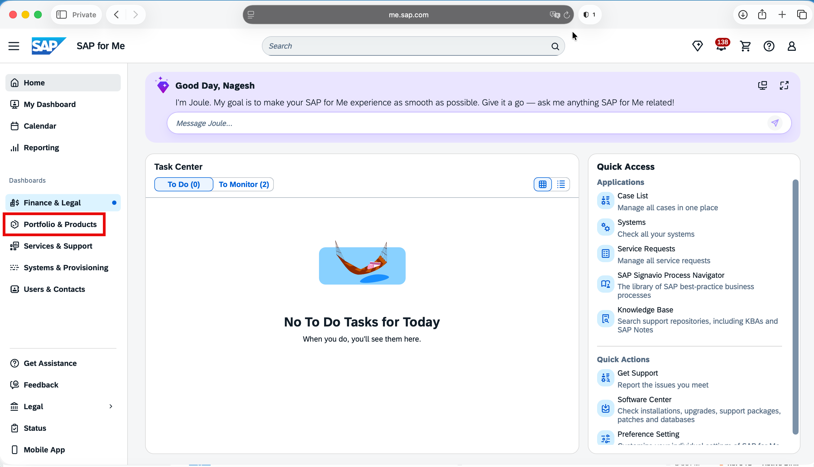

3. Click on **My Product Packages** -> select **Artificial Intelligence** -> click on **Joule**

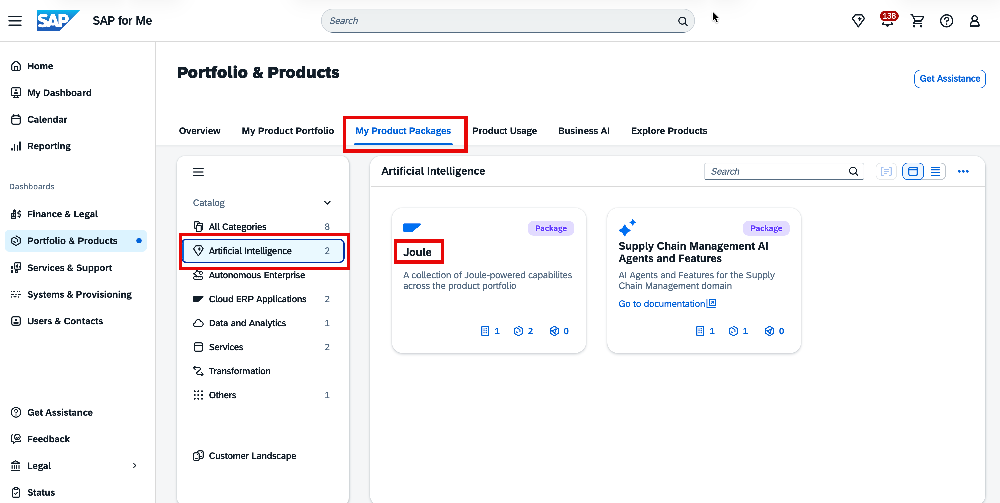

---

### Step 2 – Start Provisioning

On the Joule product page, locate **Joule Work Desktop** and click **Start Provisioning**.

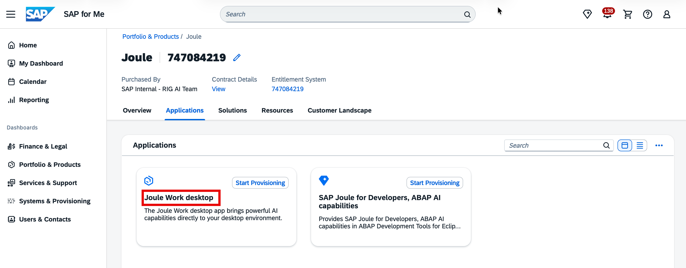

---

### Step 3 – General Information

In the **General Information** page of the wizard:

| Field | Value |
|---|---|
| **Name** | Enter a recognizable name for your JWD setup (e.g., `JWD-<your-org-name>`) |
| **Path** | Select or create a **Resource Group** container |
| **Business Type** | `Production` |

#### Creating a New Resource Group

If you don't have an existing resource group:
1. Click the **Select Resource Group** icon
2. Click **Create resource group**
3. Enter a name (e.g., `JWD Resource Group`)

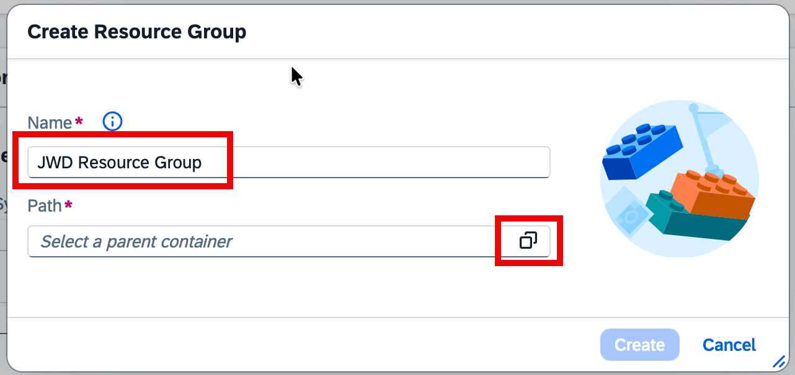

4. Set the path to your organization by clicking the path icon and selecting your org

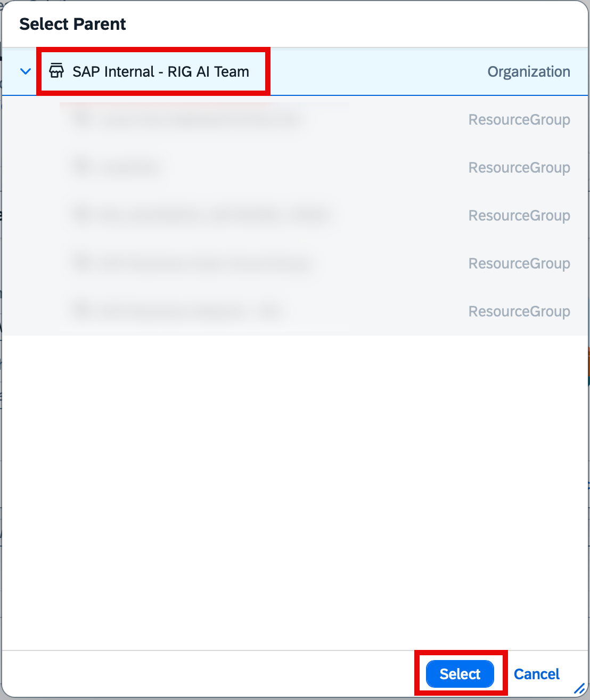

5. Click **Create**

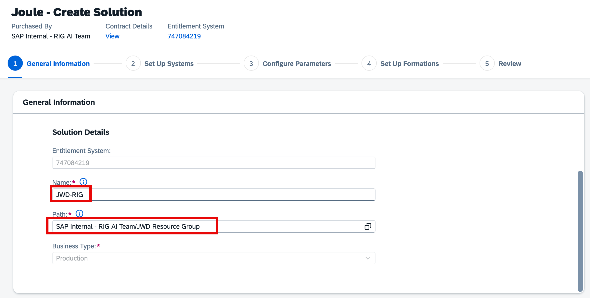

> **Tip:** Organize provisioning resources using nested folders and resource groups. If your account hierarchy is not yet set up, close the wizard and configure it in the **Resources** tab first.

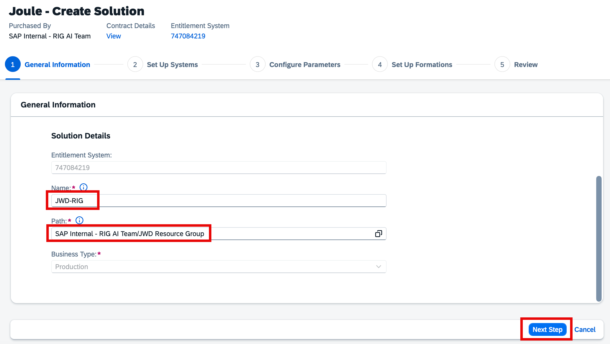

---

### Step 4 – Set Up Systems

In the **Set Up Systems** page:

1. Under **Integration with SAP Cloud Identity Services**, select your **productive IAS tenant**
2. Ensure it is the tenant used for your organization's rollout
3. Click **Next Step**

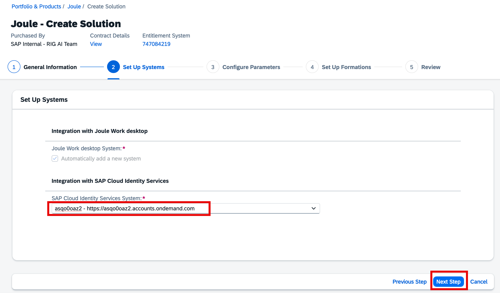

Scroll down to review the optional system integration connections (SAP S/4HANA Cloud, SAP SuccessFactors, SAP LeanIX, SAP Ariba). These are optional — leave blank if not required.

---

### Step 5 – Configure Parameters (Region)

Select the hosting region for JWD services:

| Option | SAP BTP Region |
|---|---|
| Germany (Preferred) | **EU10** |
| European Union | EU10 |
| USA (preferably East) | **US10** |
| USA | US10 |

> **Note:** Currently, only **EU10** and **US10** are supported. More Data Centres will be rolled out.

Click **Next Step**.

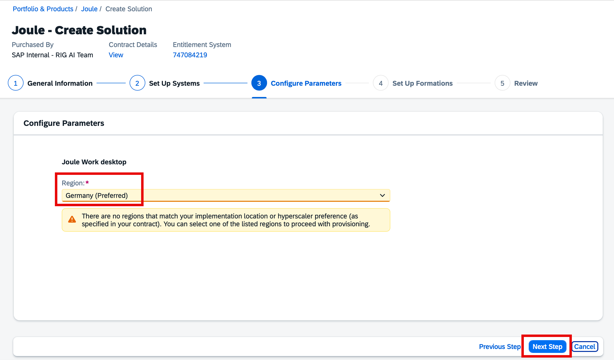

---

### Step 6 – Set Up Formations

A pre-populated formation name is shown (e.g., `sap-joule-work-desktop-c2a-rig`). You may modify it.

Click **Review**.

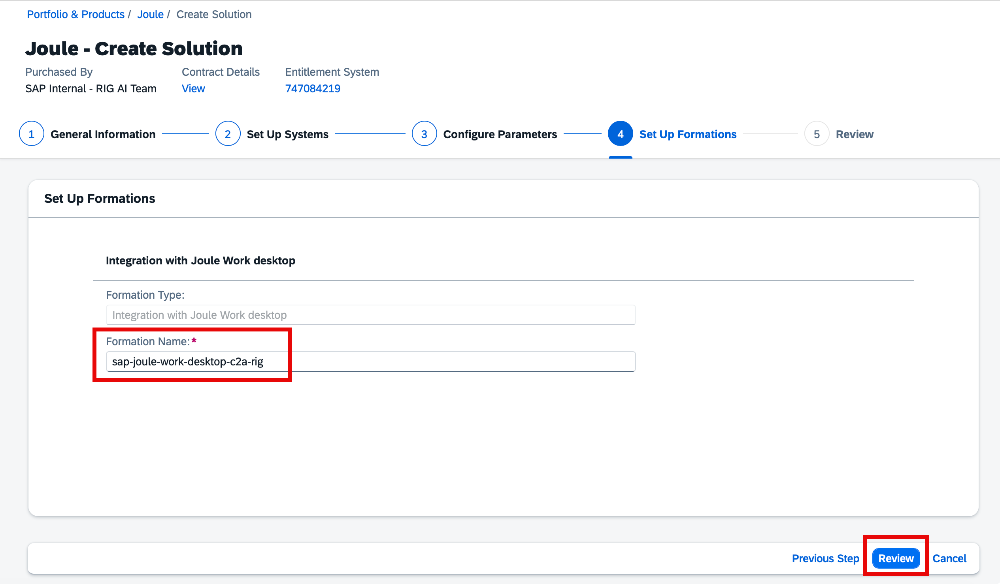

---

### Step 7 – Review and Finish

Review all selected options:
- General Information
- Set Up Systems
- Configure Parameters
- Set Up Formations

If everything looks correct, click **Finish**.

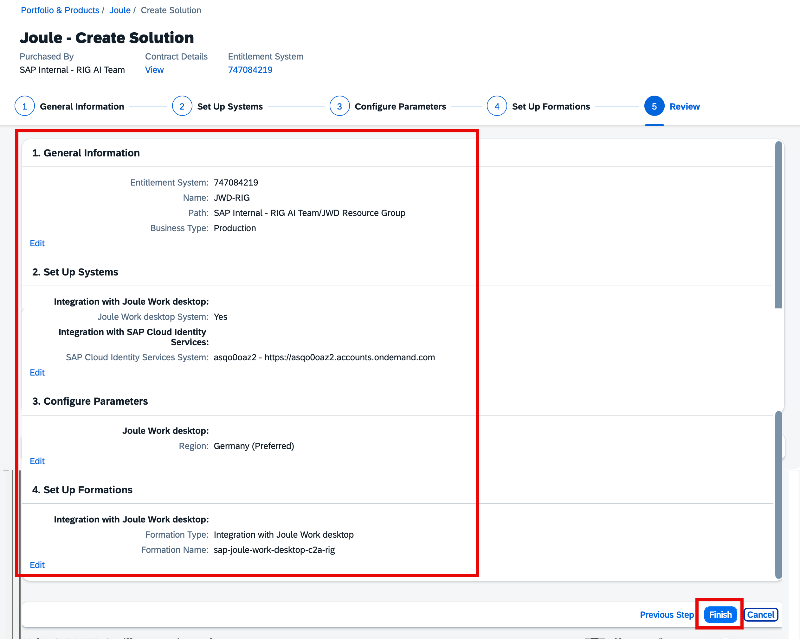

---

## Monitoring Provisioning Status

After clicking **Finish**, a confirmation dialog confirms the provisioning request has started. Click **View in Resources** to monitor progress.

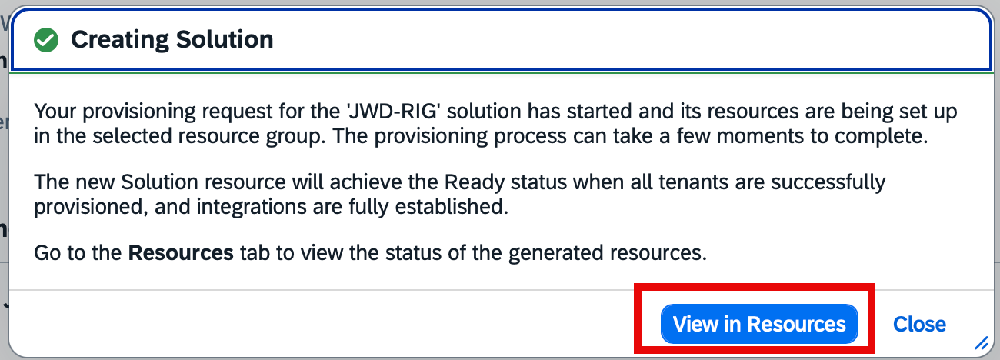

Provisioning takes approximately **10-15 minutes**. Find the JWD entry in your resource path and wait for the **Ready** status.

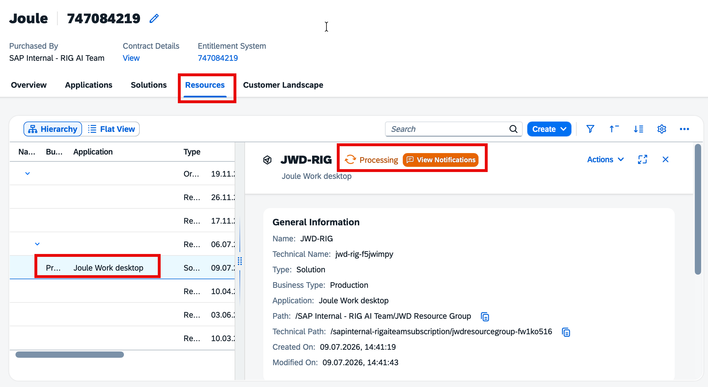

Click on the JWD solution entry to view its details — the **Name**, **Technical Name**, **Path**, and provisioned **Tenant** are shown in the panel on the right.

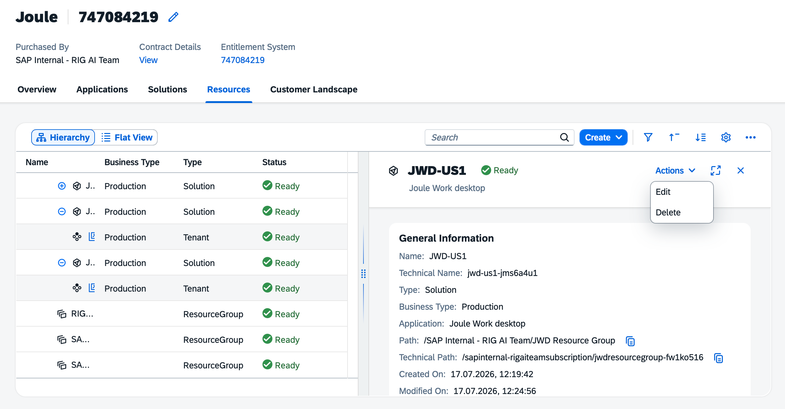

---

## Access Information

Once provisioning is complete with **Ready** status, click on the JWD tenant entry in the Resources tab. Locate the **Access Information** section and copy the **Main URL** — this is your JWD Gateway URL.

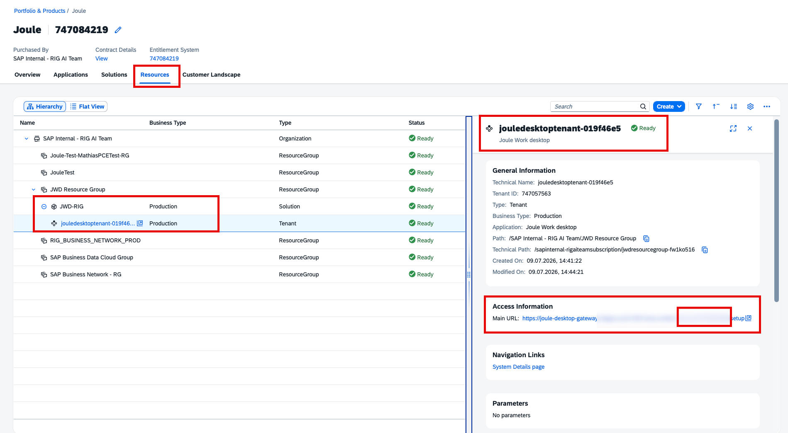

The gateway page shows two options:
- **Client Setup** – connection details for the JWD desktop client
- **Tenant Administration** – manage your JWD tenant settings

### Client Setup Details

Click **Client Setup** to find:

| Field | Description |
|---|---|
| **SAP Cloud Identity Services URL** | Your IAS tenant URL |
| **Zone UUID** | Unique identifier for your IAS zone |
| **Client ID** | Auto-generated client identifier |
| **Gateway URL** | JWD backend URL for client connection |

> **Important:** Note the **Tenant ID** from the end of the Gateway URL — you will need it for subsequent steps.

---

## Next Step

Proceed to [3.2_Download_Executable_in_SAP4ME.md](./3.2_Download_Executable_in_SAP4ME.md) to download and install the JWD client application.
