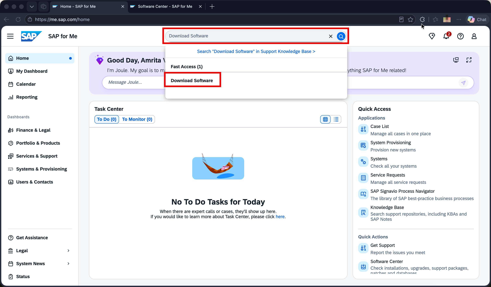
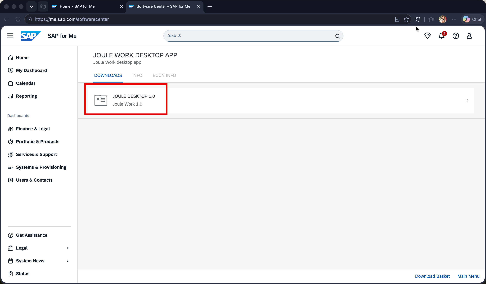
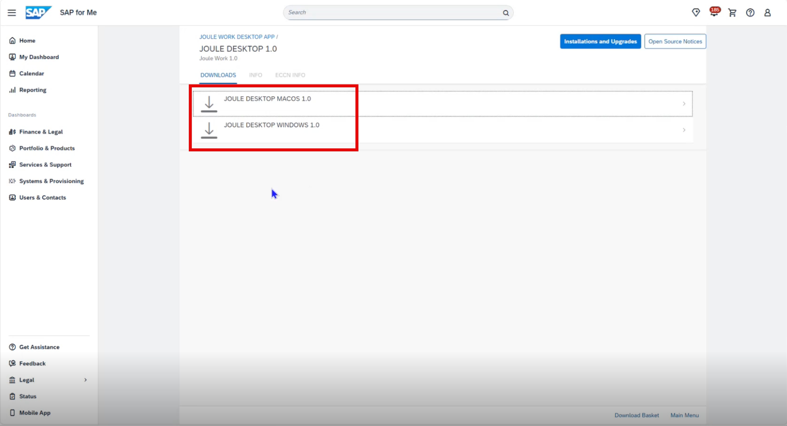
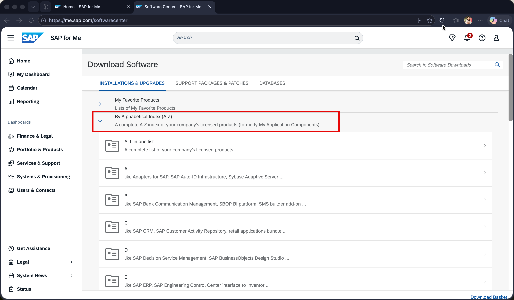
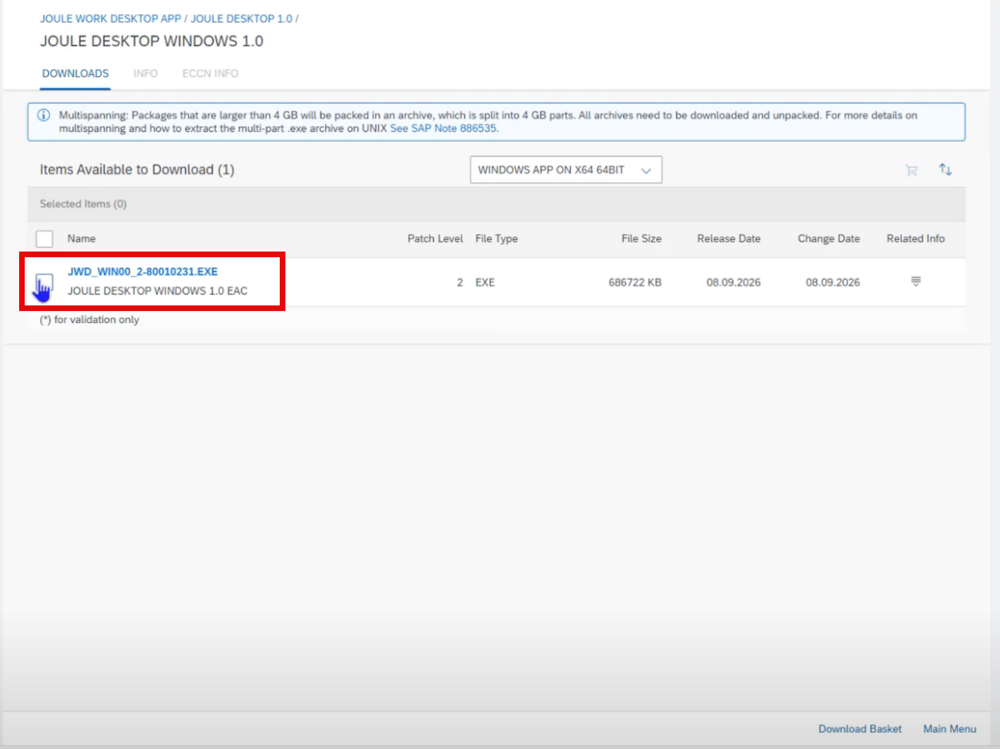
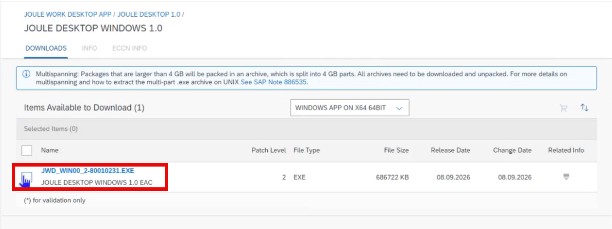

# Download and Install Joule Work Desktop

After provisioning, download the JWD desktop client from the **SAP for Me Software Center**.

---

## Step 1 – Open Software Center in SAP for Me

1. Log in to [https://me.sap.com](https://me.sap.com)
2. In the top search bar, type **Download Software**

3. Click the **Download Software** result under **Fast Access** — this opens the **Software Center**

---

## Step 2 – Navigate to Joule Work Desktop

1. In the Software Center, expand **"By Alphabetical Index (A-Z)"**
2. Click the letter **"J"**

---

## Step 3 – Select the Product

1. Select **JOULE WORK DESKTOP APP** from the product list

2. Select **JOULE DESKTOP 1.0** from the version list

3. On the Downloads tab, select the installer for your operating system:

| Platform | Package |
|---|---|
| **Windows** | `JOULE DESKTOP WINDOWS 1.0` |
| **macOS** | `JOULE DESKTOP MACOS 1.0` |

---

## Step 4 – Download the Installer

Click the **filename** to start the download.

> **Example (Windows):** `JWD_WIN00_2-80010231.EXE` (~686 MB)

---

## Step 5 – Install the Application

Once downloaded:

- **Windows:** Run the `.exe` installer and follow the installation wizard
- **macOS:** Open the `.dmg` file and drag the application to your Applications folder

> **Important:** Do not open the JWD application yet. You must first configure user access in IAS (next step) before connecting.

---

## Next Step

Proceed to [3.3_Configure_Users_and_Groups_IAS.md](./3.3_Configure_Users_and_Groups_IAS.md) to assign users to the correct IAS groups — this is required before you can connect and log in to the JWD client.
