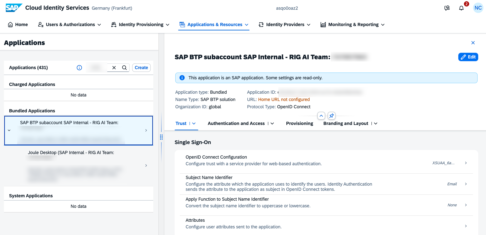
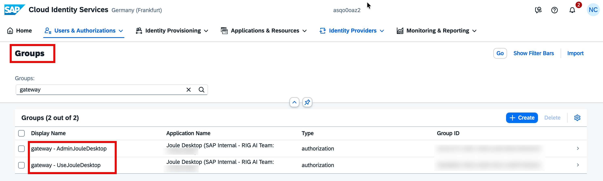
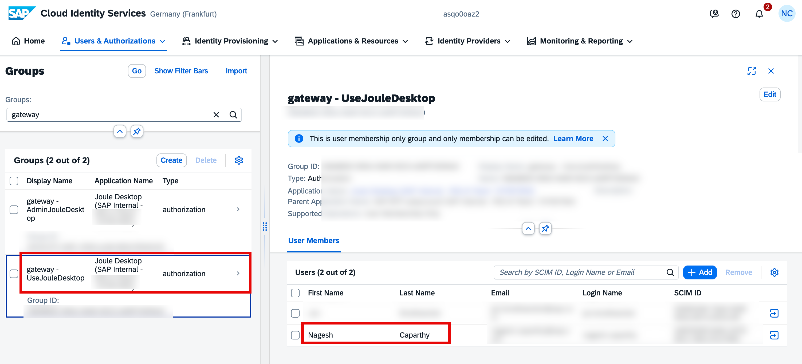
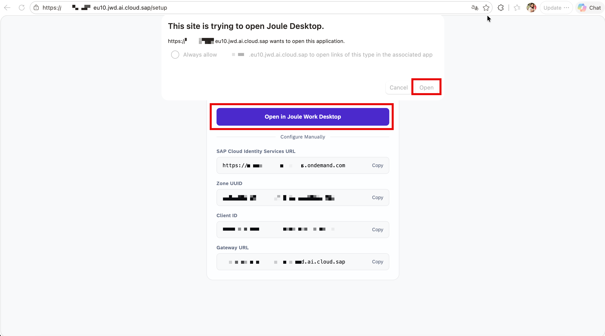
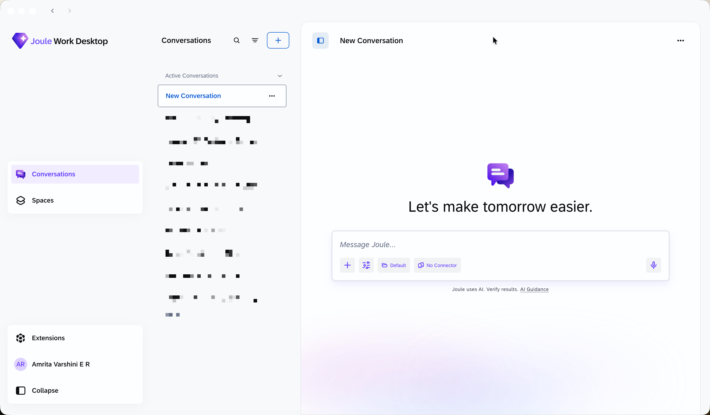

# Configure Users and Groups in SAP Cloud Identity Authentication Service

After provisioning, a JWD application and two authorization groups are automatically created in your **SAP Cloud Identity Services (IAS)** tenant. This step validates the setup and assigns users to the correct groups.

---

## Step 1 – Locate the JWD Application in IAS

1. Log in to your **SAP Cloud Identity Services** admin portal
2. Navigate to **Applications & Resources → Applications**
3. In the search box, enter the **application ID** found in the JWD Gateway URL (the number at the end of the URL)
4. The JWD application appears as a **Bundled Application** (SAP BTP solution)



---

## Step 2 – Review Application Settings

Click on the application to explore its configuration tabs:

| Tab | Description |
|---|---|
| **Trust** | OpenID Connect configuration and identity providers |
| **Authentication and Access** | SSO configuration and conditional authentication rules |
| **Provisioning** | User provisioning settings |
| **Branding and Layout** | UI customization |

> **Note:** Some settings may be read-only as this is an SAP-managed bundled application.

---

## Step 3 – Verify User Groups

Navigate to **Users & Authorizations → Groups** and search for `gateway`.

You should see **2 groups** created automatically:

| Display Name | Application | Type |
|---|---|---|
| `gateway - AdminJouleDesktop` | Joule Desktop (SAP Internal) | authorization |
| `gateway - UseJouleDesktop` | Joule Desktop (SAP Internal) | authorization |



If you do not see these groups, wait a few minutes after provisioning and refresh. If they still do not appear, verify that provisioning status is **Ready** in SAP for Me.

---

## Step 4 – Assign Admin User

To grant a user access to the JWD Admin Portal:

1. Click on **`gateway - AdminJouleDesktop`**
2. Under **User Members**, click **+ Add**
3. Search by SCIM ID, Login Name, or Email
4. Select the user and save

---

## Step 5 – Assign End Users

To grant standard users access to the JWD client:

1. Click on **`gateway - UseJouleDesktop`**
2. Under **User Members**, click **+ Add**
3. Search for users by SCIM ID, Login Name, or Email
4. Select the user(s) and save



> **Important:** Every JWD user (admin and end user) must be assigned to `UseJouleDesktop`. Without this group, users receive an **Access Denied** error when logging in to the JWD client.

---

## Next Step

Once all users are assigned, proceed below to connect the JWD client to your tenant.

---

## Part 2 – Connect JWD to Your Tenant

### Step 6 – Open the Setup URL

After installation, open the JWD Client Setup page in a browser using the Gateway URL from your provisioning:

```
https://joule-desktop-gateway.cfapps.<region>.hana.ondemand.com/<TENANT_ID>/setup
```

Example:
```
https://joule-desktop-gateway.cfapps.eu10-005.hana.ondemand.com/<tenant_id>/setup
```

The gateway page shows two options:
- **Client Setup** – connection details for the JWD desktop client
- **Tenant Administration** – manage your JWD tenant settings

Click **Client Setup**. The page will show the following connection details:

| Field | Description |
|---|---|
| **SAP Cloud Identity Services URL** | Your IAS tenant URL |
| **Zone UUID** | Unique identifier for your IAS zone |
| **Client ID** | Auto-generated client identifier |
| **Gateway URL** | JWD backend URL for client connection |

> **Important:** Note the **Tenant ID** from the end of the Gateway URL — you will need it to access the Admin Portal in later steps.

Click **Open in Joule Work Desktop**.



---

### Step 7 – Allow the Application to Open

A browser prompt will appear asking to open the JWD application. Click **Open**.

The JWD client automatically receives the connection parameters (IAS URL, Client ID, Gateway URL).



---

### Step 8 – Connect

In the JWD desktop client, the connection details are pre-filled:

| Field | Value |
|---|---|
| **IAS URL** | Your SAP Cloud Identity Services URL |
| **Client ID** | Auto-generated Client ID |
| **Gateway URL** | `https://joule-desktop-gateway.cfapps.<region>.hana.ondemand.com` |

Click **Connect**.


---

### Step 9 – Authenticate

Authentication follows the flow configured in IAS:

#### Default Flow (IAS Authentication)
1. Enter your **Email or User Name** on the IAS login screen
2. Click **Continue**
3. Enter your password and sign in

#### Microsoft Entra Flow (if configured)
1. Enter your email address — IAS evaluates the domain
2. You are redirected to **Microsoft Entra** for authentication
3. Enter your Microsoft password and click **Sign in**


---

### Step 10 – Verify Successful Login

Upon successful authentication, the browser shows:

> **Login successful**
> You can close this tab and return to Joule Desktop.


The JWD application is now open and ready to use.

---

## JWD Client Overview

After login, the main JWD interface shows:

| Area | Description |
|---|---|
| **Conversations** | Active and past AI conversations |
| **Spaces** | Context-specific workspaces |
| **Extensions** | Installed extensions and connectors |
| **Settings** | Account, personalization, and Microsoft 365 account settings |
| **Message Joule** | Input field for AI queries (text and voice) |


> For detailed end-user guidance, see the [SAP Help Portal: Joule Work Desktop Users' Guide](https://help.sap.com).

---

## Next Step

Proceed to [3.4_Configure_Administrator_Settings.md](./3.4_Configure_Administrator_Settings.md) *(Optional)* to configure tenant-level settings via the JWD Admin Portal.
