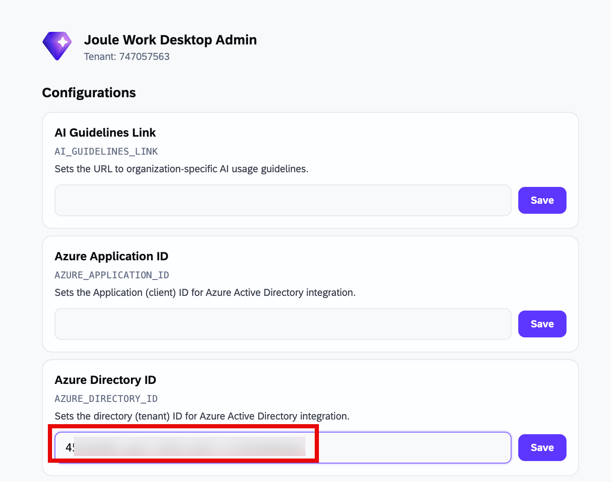
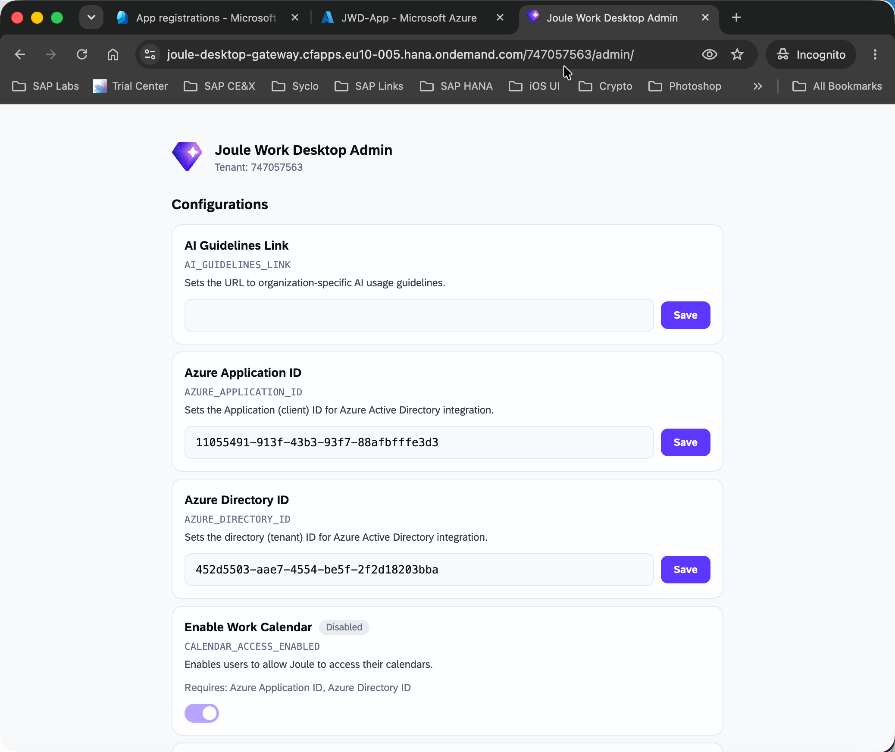
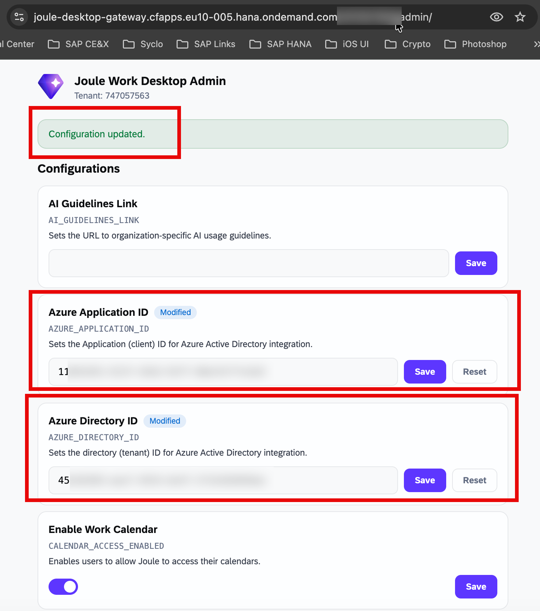

# Configure Administrator Settings

> **Optional** — This step is only required if you want to customize tenant-level behavior for your JWD deployment.

The **JWD Admin Portal** is a web application that allows administrators to manage tenant-level settings for Joule Work Desktop.

---

## Accessing the Admin Portal

Use the following URL pattern to open the admin portal:

```
https://joule-desktop-gateway.cfapps.<region>.hana.ondemand.com/<TENANT_ID>/admin/
```

Replace:
- `<region>` — e.g., `eu10-005` or `us10`
- `<TENANT_ID>` — found at the end of your Gateway URL from SAP4ME provisioning

You can also access it via the JWD Gateway overview page by clicking **Tenant Administration**.

> You must be assigned to the `gateway - AdminJouleDesktop` group in IAS to access this portal.

For detailed admin documentation, see the [SAP Help Portal: Joule Work Desktop Administration Guide](https://help.sap.com).



---

## Admin Configuration Options

### General Settings

| Setting | Description |
|---|---|
| **Enable Automatic Updates** | Allows the JWD client to auto-update to the latest version |
| **AI Guidelines Link** | URL pointing to your organization's AI usage policy |
| **Enable Spaces** | Allows users to create dynamic, context-specific workspaces |

---

### Custom Guardrails

Define LLM-judged policies that block prompts violating your organization's rules.

> **Note:** Each guardrail runs as a separate LLM judge on every user prompt. Use sparingly to avoid unnecessary latency and cost.

To add a guardrail, click **Add Guardrail** and enter the policy description.

---

### Quota Management

| Setting | Description |
|---|---|
| **Tenant Usage (Monthly): Messages** | Displays total usage across all users for the current period |
| **User Usage (Daily): Messages** | Sets the maximum number of messages per user per day (default: `1000`) |

---

### Microsoft 365 Integration

This section connects JWD to your Microsoft 365 environment. Configure this after completing [3.5_Setup_Microsoft_Outlook_Integration.md](./3.5_Setup_Microsoft_Outlook_Integration.md).

| Setting | Description |
|---|---|
| **Enable Work Email** | Allows users to access their email via Joule |
| **Enable Work Calendar** | Allows users to access their calendar via Joule |
| **Microsoft 365 Application ID** | The Application (client) ID from your Azure App Registration |
| **Microsoft 365 Directory ID** | The Directory (tenant) ID from your Azure App Registration |

Enter both IDs and click **Save** next to each field. A success confirmation appears once saved.





> **Note:** Work Email is auto-enabled in the JWD client after saving. Work Calendar must be toggled on manually by each user in their JWD Settings.

---

### Custom Marketplace

| Setting | Description |
|---|---|
| **Custom Marketplace Name** | Display name for your organization's extension marketplace |
| **Custom Marketplace URL** | URL to the custom extension marketplace |

---

### MCP Servers

Add and manage Model Context Protocol (MCP) servers that extend JWD's capabilities with external data sources.

| Setting | Description |
|---|---|
| **Default MCP Servers** | Pre-configured MCP servers available to all users |
| **MCP Server Access Policies** | Defines which MCP endpoints users can reach |

Click **Add MCP Server** or **Add MCP Access Policy** to configure.

For building custom MCP servers, see [4_Develop/4.1_Develop_MCP_Servers_SAP_Integration_Suite.md](../4_Develop/4.1_Develop_MCP_Servers_SAP_Integration_Suite.md).

---

### Data Export

Export all tenant data in structured JSON format for compliance and backup:

- Tenant metadata (ID, host, subdomain, enrollment date)
- All configuration settings with labels, descriptions, and values

Click **Download JSON Export** to download.

---

## Next Step

Proceed to [3.5_Setup_Microsoft_Outlook_Integration.md](./3.5_Setup_Microsoft_Outlook_Integration.md) *(Optional)* to configure Microsoft Entra SSO and Microsoft 365 email/calendar access.
