# Set up Microsoft Outlook Integration

> **Optional** — Complete this step if you want to enable Microsoft 365 email and calendar access in JWD, or configure Microsoft Entra SSO for your users.

SAP Joule Work Desktop supports third-party Identity Provider authentication and Microsoft 365 connectivity. This guide covers:

1. **Microsoft Entra SSO** — route users to Microsoft Entra for authentication via IAS Conditional Authentication
2. **Email & Calendar Access** — register an Azure app and grant Microsoft Graph API permissions
3. **Validation** — test that email and calendar work correctly in JWD

---

## Part 1 – Configure Microsoft Entra SSO in IAS

### Step 1 – Open Conditional Authentication

1. Log in to **SAP Cloud Identity Services**
2. Navigate to **Applications & Resources → Applications**
3. Search for and open your **JWD application**
4. Click **Authentication and Access → Conditional Authentication**

### Step 2 – Add an Authentication Rule

Click **Add Rule** and configure:

| Field | Example Value |
|---|---|
| **Priority** | `1` |
| **Identity Provider** | Your Microsoft Entra IdP (e.g., MS Copilot) |
| **Email Domain** | Your company domain (e.g., `contoso.com`) |
| **User Type** | `Any` |
| **User Group** | `Any` |
| **IP Range** | `Any` |

This routes users with matching email domains to authenticate via Microsoft Entra.

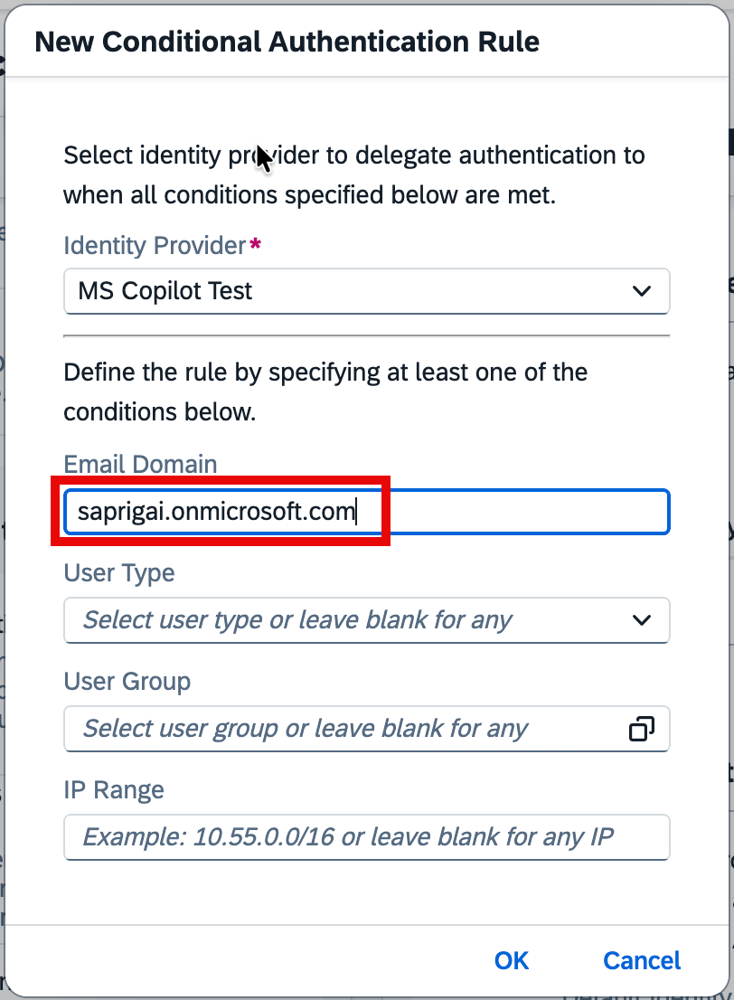

---

## Part 2 – Configure Identity Federation

When using a corporate IdP (MS Entra or others), configure **Identity Federation** so that IAS group assignments are passed through correctly. Without this, users receive **Access Denied** errors even when assigned to the correct IAS group.

### Step 3 – Open Identity Federation

1. In your JWD IAS Application, scroll to **Identity Federation**
2. Click **Edit**

### Step 4 – Select "Custom" Configuration Source

Change the **Source** from `Corporate IdP` to **`Custom`**.


### Step 5 – Enable "Use Identity Authentication User Store"

Check the **Use Identity Authentication user store** checkbox.

This ensures that user attributes are taken from the IAS user store (including group assignments) rather than from the corporate IdP assertion.


### Step 6 – Verify Attributes

Click **Attributes** in the IAS application and confirm that `groups` from **Identity Directory** is passed through:

| Attribute Name | Source | Value |
|---|---|---|
| `email` | Identity Directory | Email |
| `family_name` | Identity Directory | Last Name |
| `given_name` | Identity Directory | First Name |
| `groups` | Identity Directory | **All Groups** |
| `user_uuid` | Identity Directory | Global User ID |


---

## Part 3 – Register App in Microsoft Entra for Email & Calendar

### Step 7 – Create App Registration

1. Open the **Microsoft Entra admin center** and navigate to **Entra ID → App registrations**

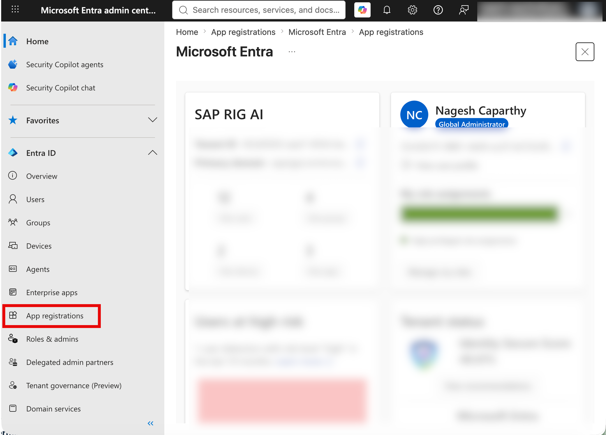

2. Click **New Registration** and fill in:

| Field | Value |
|---|---|
| **Name** | `JWD-App` (or your preferred name) |
| **Supported account types** | Single tenant (your organization only) |
| **Redirect URI** | Platform: `Public client/native (mobile & desktop)`, URL: `http://localhost` |

4. Click **Register**

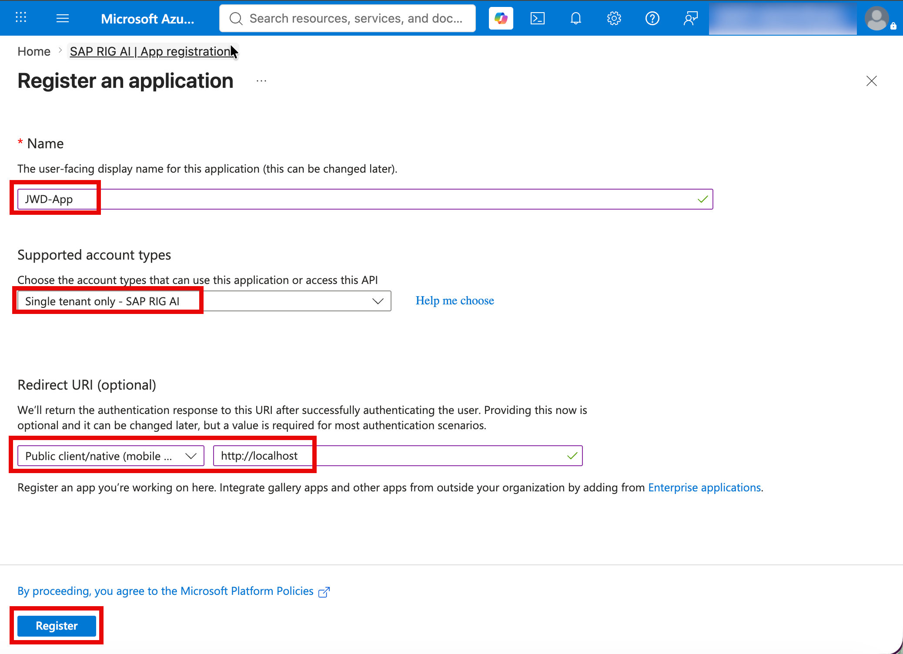

### Step 8 – Note the Application and Directory IDs

From the **Overview** page, record:

| Value | Location |
|---|---|
| **Application (client) ID** | Essentials section |
| **Directory (tenant) ID** | Essentials section |

These are required for the JWD Admin Portal configuration.

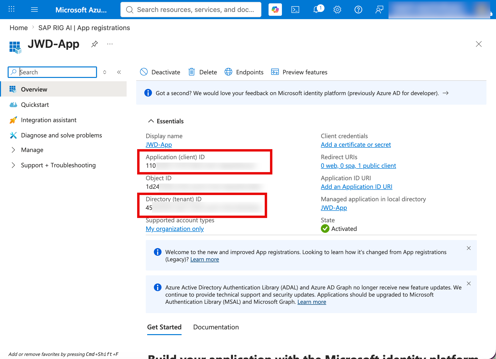

### Step 8a – Verify Redirect URI

1. In the left menu, click **Authentication**
2. Confirm the **Redirect URI** shows `http://localhost` under **Mobile and desktop applications**

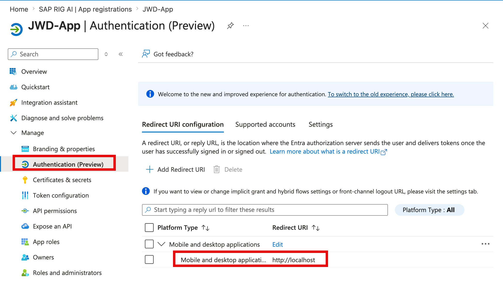

---

### Step 9 – Add API Permissions

1. Click **API Permissions → Add a Permission**

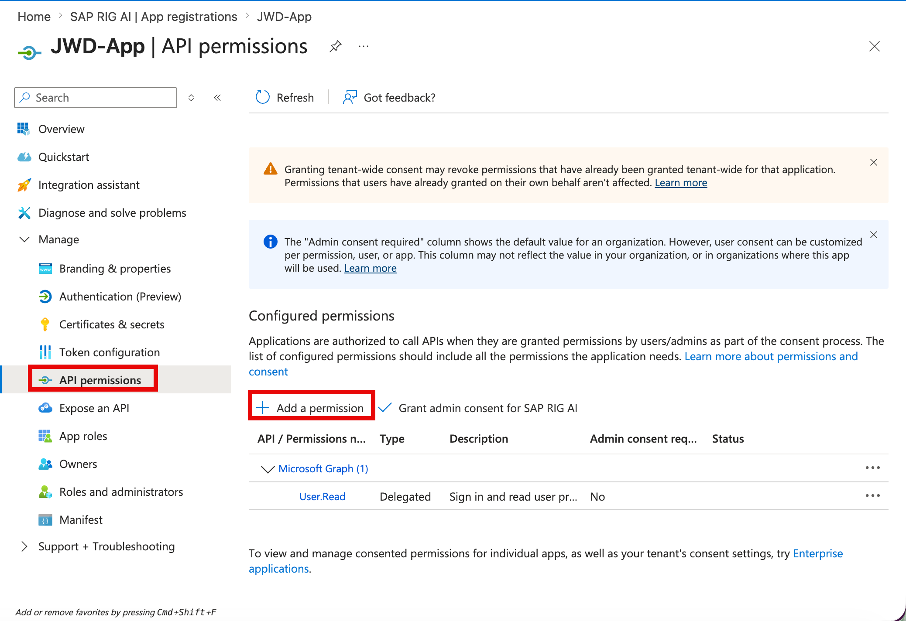

2. Select **Microsoft Graph**

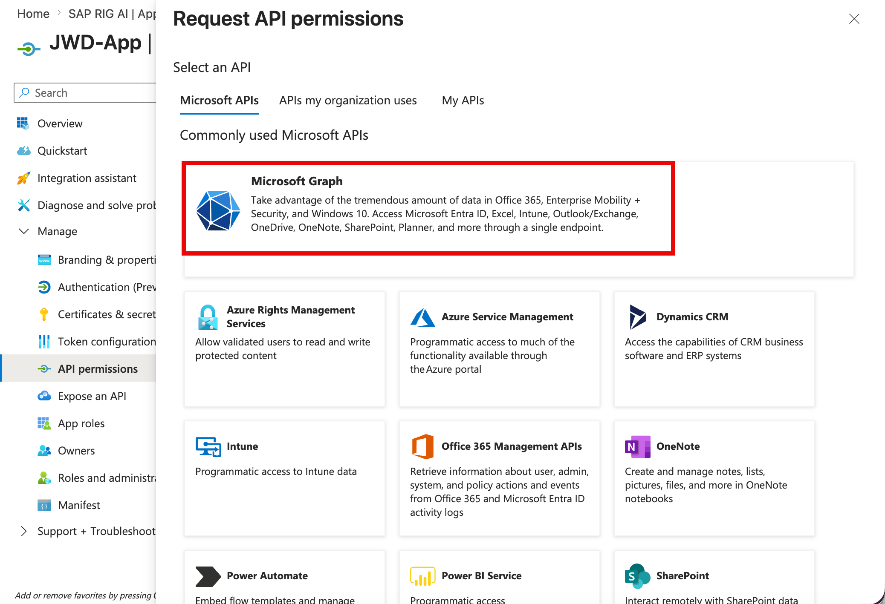

3. Select **Delegated Permissions**

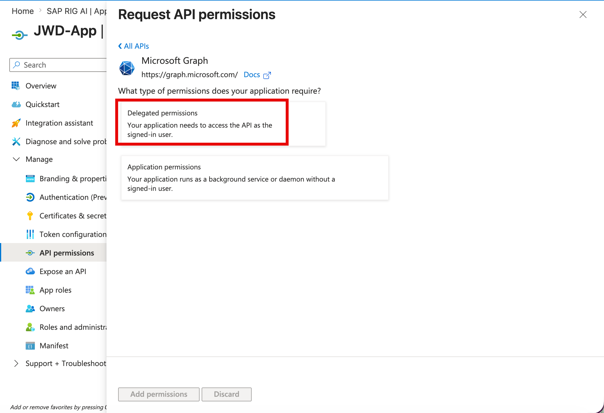

4. Add the following permissions:

| Permission | Description |
|---|---|
| `Calendars.Read` | Read events and availability from the user's calendars |
| `Mail.Read` | Read all emails in the user's primary mailbox |
| `Mail.Read.Shared` | Read emails from mailboxes shared with the signed-in user |
| `MailboxFolder.Read` | List mailbox folder structure |
| `offline_access` | Returns a Refresh Token to maintain access when user is offline |
| `User.Read` | Read the basic profile of the signed-in user (added by default) |

Search for and select each permission — for example:

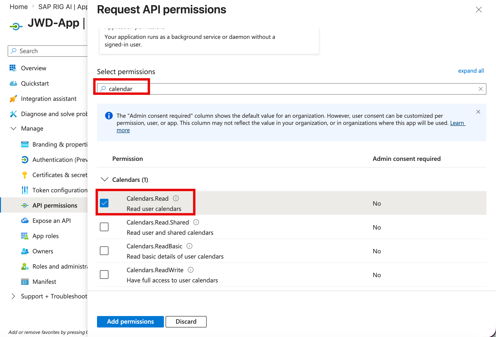

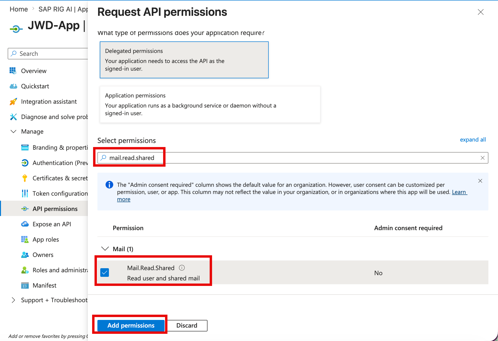

5. Click **Add permissions**

After adding all permissions, the list should show 6 Microsoft Graph permissions:

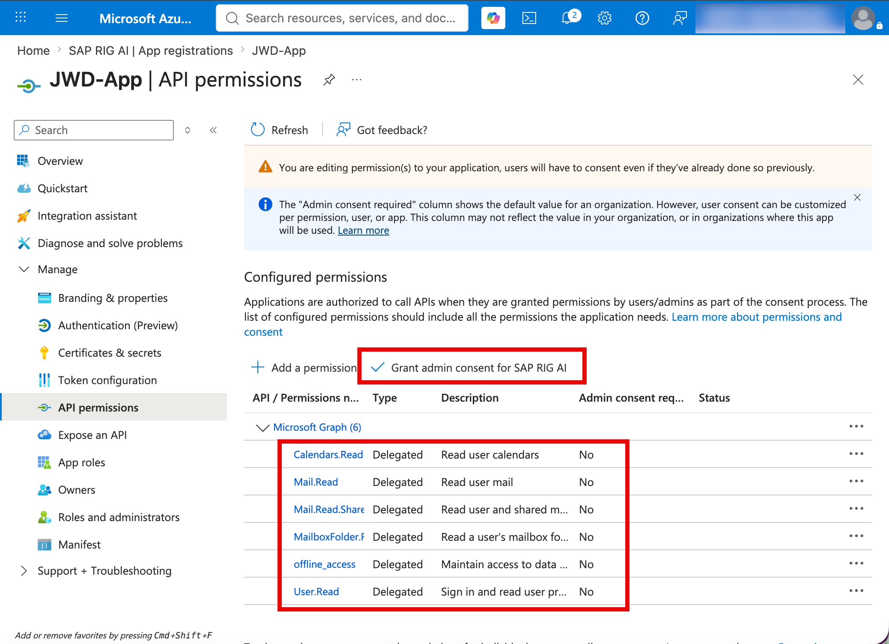

### Step 10 – Grant Admin Consent

1. Click **✓ Grant admin consent for [Your Organization]**

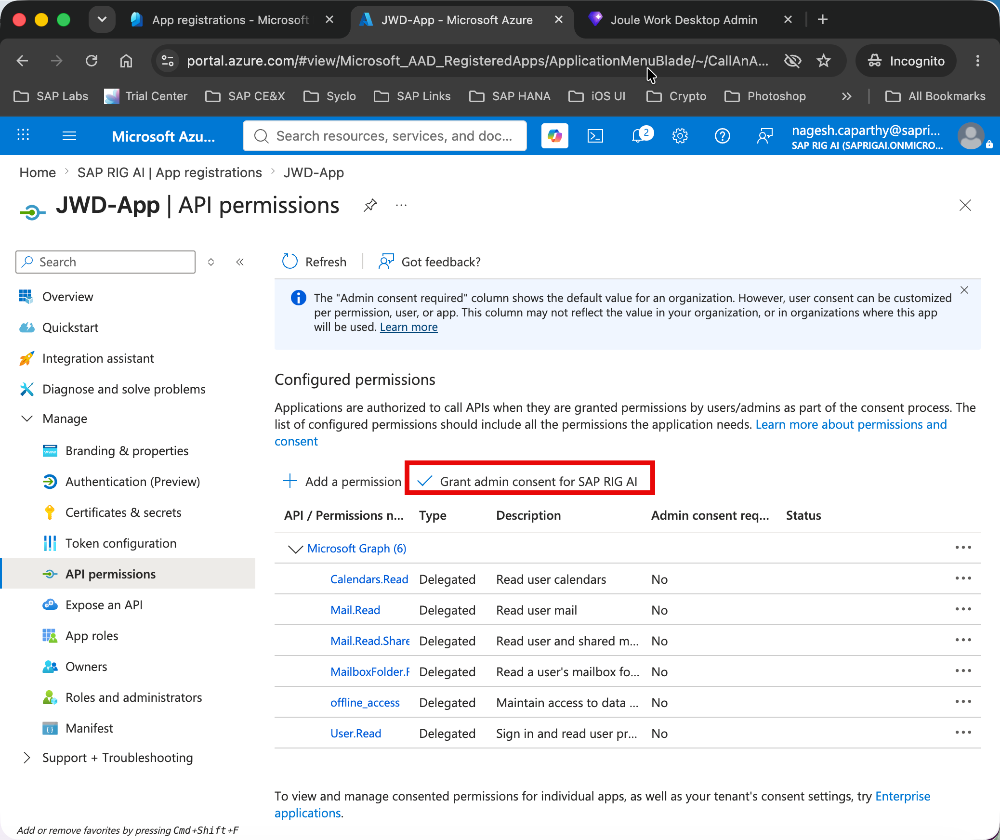

2. Confirm by clicking **Yes**

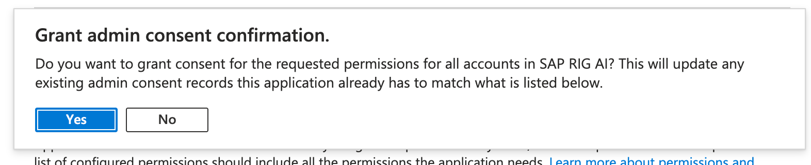

3. All permissions should show **Granted for [Your Organization]** status

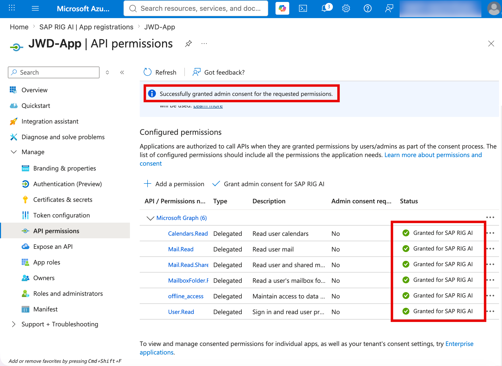

---

## Part 4 – Update JWD Admin Portal

### Step 11 – Enter Microsoft 365 IDs

1. Navigate to the **JWD Admin Portal**
   ```
   https://joule-desktop-gateway.cfapps.<region>.hana.ondemand.com/<TENANT_ID>/admin/
   ```
2. Under **Microsoft 365 Integration**, toggle on:
   - **Enable Work Email**
   - **Enable Work Calendar**
3. Enter the values recorded in Step 8:
   - **Microsoft 365 Application ID** (client ID)
   - **Microsoft 365 Directory ID** (tenant ID)
4. Click **Save**

> **Note:** Work Email is auto-enabled in the JWD client after saving. Work Calendar must be toggled on manually by each user in their JWD Settings.


---

## Part 5 – Validate Email and Calendar

### Step 12 – Enable Calendar in User Settings

Work Email is auto-enabled after the admin configuration. Work Calendar must be enabled manually per user:

1. In JWD, click your profile icon (bottom-left)
2. Click **Settings**
3. Navigate to the **Account** tab
4. Under **Microsoft Account**, toggle **Calendar** to enabled
5. Authenticate with your Microsoft account if prompted

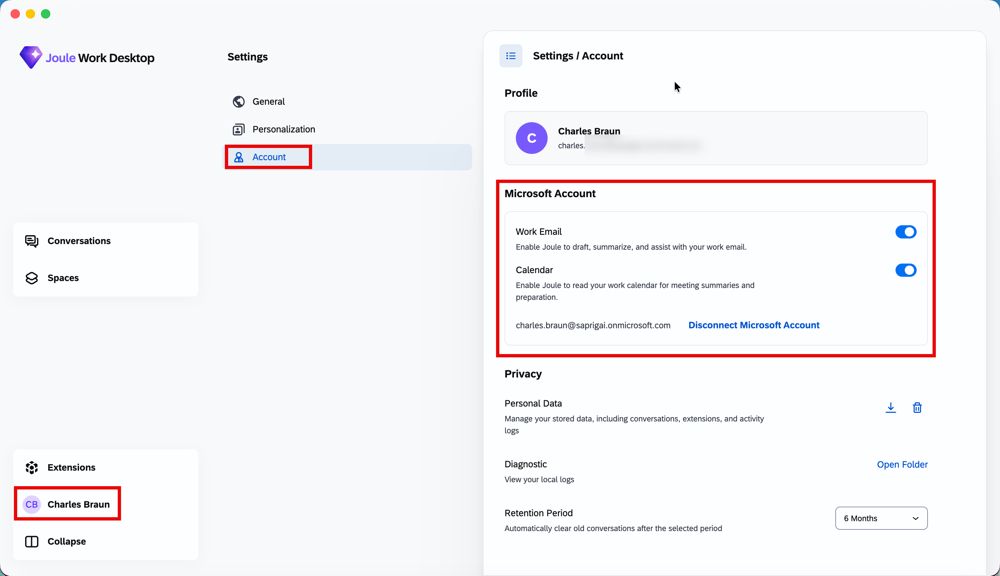

### Step 13 – Test Email Access

In the JWD main interface, start a new conversation and type:

```
What is my last email?
```

Expected result: JWD returns a summary of your most recent email including sender, subject, date, and a preview.

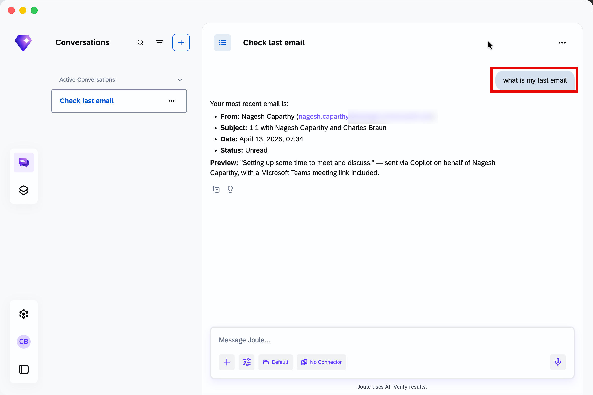

### Step 14 – Test Calendar Access

In a new conversation, type:

```
What do I have on my calendar today?
```

Expected result: JWD returns a summary of today's calendar events.

---

## Troubleshooting

| Issue | Resolution |
|---|---|
| "Access Denied" on JWD login | Verify the user is assigned to the `UseJouleDesktop` IAS group |
| Email not accessible | Confirm `Mail.Read` permission is granted in the Azure App Registration |
| Calendar not showing | Ensure `Calendars.Read` is granted and admin consent is given |
| Authentication loop | Complete the Entra authentication and return to JWD |
| "No Connector" shown | Confirm Microsoft 365 integration is enabled in the JWD Admin Portal |

---

## Next Step

Proceed to [4_Develop/4.1_Develop_MCP_Servers_SAP_Integration_Suite.md](../4_Develop/4.1_Develop_MCP_Servers_SAP_Integration_Suite.md) *(Optional)* to extend JWD with custom MCP connectors — or go to [5_Complete/5.2_Complete_the_Mission.md](../5_Complete/5.2_Complete_the_Mission.md) to finalize.
